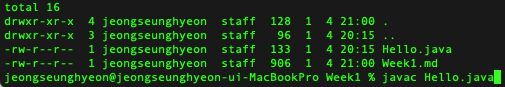
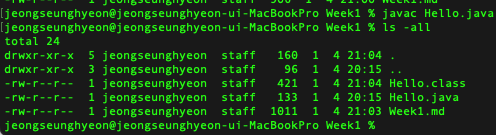
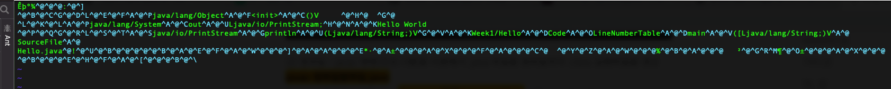
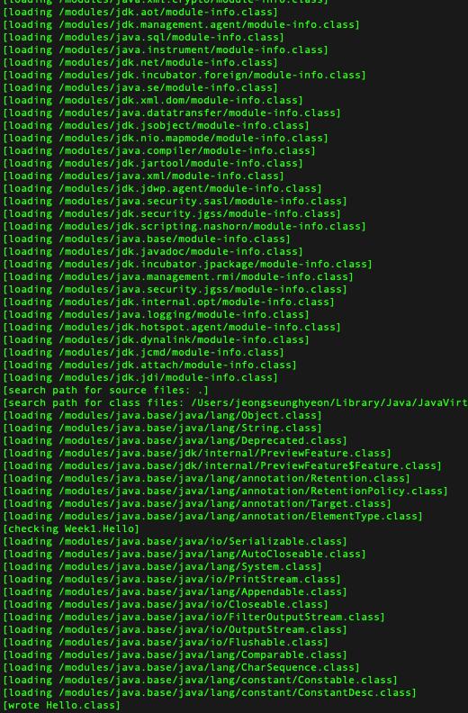
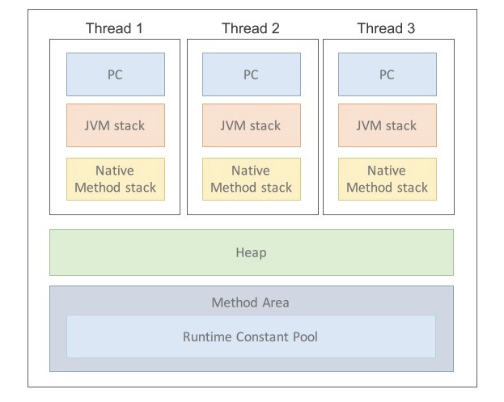

# JVM 이란 무엇인가 ?

**Java Virtual Machine** 의 약자로, 자바 가상 머신의 약자를 따서 줄여 부르는 용어이다. <br>
JVM 역할은 **자바 어플리케이션을 클래스 로더를 통해 읽어 들여 자바 API 와 함께 실행하는 것**이다. <br>
그리고 JAVA 와 OS 사이에서 중개자 역할을 수행하여, JAVA 가 OS에 구애받지 않고, 재사용을 가능하게 한다. <br>
그리고 가장 중요한 **메모리관리(Garbage Collector)** 를 수행한다. <br>
그리고 JVM은 스택기반의 가상머신이다. ARM 아키텍쳐 같은 하드웨어는 레지스터 기반으로 동작하는데 비해 JVM은 스택기반으로 동작한다.

# 컴파일 하는 방법 ?

Javac 라는 자바-컴파일러를 통해, **.java** 파일을 **.class** file 로 바꿔준다. <br>
우리가 생성할때는 .java 파일로 생성하므로, Hello.java 를 만들고 실습해보자! <br>

```shell script
javac Hello.java
```



위의 명령어를 실행하고 나면 아래와 같이 .class 파일이 생기는 걸 볼 수 있다.





열어보면 위와 같이 알수 없는 문자들로 가득하다. 즉 **자바-바이트 코드**로 변환되어 있는 것이다. <br>
그렇다면 컴파일러는 왜 런타임전에 이런작업을 해주는 걸까? 컴파일러 과정에서 어떤걸 하이는지 알아보자!

# 바이트 코드란 무엇인가?

Class를 동적으로 링킹 정보를 보여준다. 예를 들면 System.out.println 도 보면 , System 이라는 클래스의 member 변수 out 객체의 static method 인
println이라는 메소드를 불러오는 것이다. 그렇다면 System 은 어느곳에 있는 클래스 인가? 라는걸 JVM 이 알아야 런타임 환경에서 ClassLoader 등등이 링킹과정을 
거칠 수 있기 때문에, Javac 를 통해 JVM이 인식할 수 있는 언어로 탈 바꿈 해준다고 생각하면 된다.
<br>
그럼 우리가 javac 의 명령어를 통해 클래스가 어떻게 링크 되는지 알아보자

```shell script
javac -verbose Hello.class
```



그럼 System.class 에 대한 연결 외에도 여러 연결들이 많듯, 해당 Class 정보를 알수 있음을 알것이다. <br>


자 지금와서 다시 아까의 자바 ByteCode 를 한번 살펴보자. 자이제 System 대신에 java/lang/System 이라고 써있지 않은가? <br>
그것이 클래스 로더에서 해당 파일을 참조하여 연결 할 수 있도록 javac 가 JVM 이 인식할 수 있도록 바꿔줬음을 알 수 있다. <br>
<br>

그래서 가끔 Spring 을 javac 로 컴파일 시키면 나는 오류들에 대해서도 이제 알 수 있을 것이다. <br>
해당 클래스에 대한 정보가 class 파일에 안적혀있는 것일 확률이 높으므로, **-classpath** 옵션을 통해 외부 라이브러리들을 지정해 주도록 하자! 

# 실행하는 방법 ?

이제 class 파일을 실행하는 방법에 대해서 알아보자! <br>
이제 전 단계에서 배웠던 클래스들의 정보를 컴파일 단계에서 Loading, Linking 및 초기화 과정을 거쳐야 할것이다. <br>

그러한 역할을 하는 부분이 **Class Loader** 라는 아이이다. <br>

해당 클래스 로더는 클래스들이 어떻게 참조되고 있는지, 그리고 런타임시에 동적으로 클래스를 로드해주는 역할을 수행한다. <br>
그래서 우리는 동적 클래스들을 런타임 상에서 불러올 수 있는 것이다! <br>

그럼 클래스 로더가 클래스를 불러와야 하므로, 자바의 Runtime Data Area 부분에 바이트 코드를 배치 시킬 것이다. <br>
근데 이렇게 되면 런타임상에 오류를 잡아야 하지 않는가? 그건 꽤나큰 불편함이다. 그래서 **Excution Engine 부분에 Compile 기능**이 있다. 이를 알아보자! <br>

**Excution Engine** 은 클래스를 실행시키는 역할인데, 이 과정에서 두가지 컴파일 방식을 사용한다. <br>

**Interpreter** : 기존의 인터프리터와 같이 자바 바이트 코드를 명령어 단위로 읽어서 실행한다. 하지만 이 방식은 언어의 단점을 그대로 가지고 있다.
한 줄 씩 수행하므로 너무나도 느리다는 단점이 있다.

# JIT 컴파일러란 무엇이며 어떻게 동작하는지 ?

**JIT(Just - In - Time)** : 인터프리터 방식의 단점을 보완하기 위해 도입된 컴파일러로, 인터 프리터 방식으로 실행하다가 적절한 시점에 바이트 코드 전체를 컴파일하여 네이팁브
코드로 변경하고, 이후에는 더 이상 인터프리팅 하지 않고, 네이티브 코드로 수행되는 방식이다. 네이티브 코드는 캐시에 보관되기 때문에 한 번 컴파일된 코드는 빠르게 수행된다.
하지만 한 번 호출된다면 컴파일러로 인터프리팅 하는 것이 유리하다. 따라서 JIT 컴파일러를 사용하는 JVM들은 내부적으로 해당 메서드가 얼마나 자주 수행되는지 체크하고, 일정 정도를 넘을
때에만 컴파일을 수행한다.

# Java RunTime Data Area 

**프로그램을 수행하기 위해 OS에서 할당받은 메모리 공간**



## PC Register

Thread 가 시작될때 생성되며 생성될 때마다 생성되는 공간으로 스레드마다 하나씩 존재한다. Thread가 어떤 부분을 어떤 명령으로 실행해야 될지에 
대한 기록을 하는 부분으로 현재 수행중인 **JVM 명령의 주소**를 가진다. 주소라는 단어가 Key Point 다. 그림처럼 하나의 Thread 에서 Key 역할을 한다고
생각하면 될것 같다!

## JVM Stack Area

프로그램 실행과정에서 임시로 할당되었다가, 메소드를 빠져나가면 바로 소멸되는 특성의 데이터를 저장하기 위한 영역이다. => 멤버변수, 필드변수 등등 <br>
메소드 호출 시 마다 각각의 스택 프레임이 생성된다. 메서드 수행이 끝나면 프레임 별로 삭제된다. <br>
**스택** 이라는 점이 중요하다. **LIFO 의 구조로 우리가 재귀함수를 호출 할 수 있는 것도 해당 Area 가 Stack 구조**이기 때문인것같다!

## Native Method Stack

자바 프로그램이 컴파일 되어 생성되는 바이트 코드가 아닌 실제 실행할 수 있는 기계어로 작성된 프로그램을 실행시키는 역할이다. <br>
Java가 아닌 다른 언어로 작성된 코드를 위한 공간이다. Java Native Interface 를 통해 바이트 코드로 변환되어 저장하게 된다. <br>
일반 프로그램처럼 커널이 스택을 잡아 독자적으로 프로그램을 실행시키는 역할이다. <br> 

## Method Area(=: Class Area =: Static Area)

클래스 정보를 처음 메모리 공간에 올릴 때 초기화되는 대상을 저장하기 위한 메모리 공간. <br>
즉, 우리가 아까 봤던 Static 한 System 또한 이곳에 있을 것이다. 그래서 우리가 초기화 시키지 않고도, 메모리에 로드시킬때 초기화 시킴으로써,
우리가 사용할 수 있는 것이다. 그래서 Method Area 는 Class 를 위한 공간으로 Field 의 정보, Method 의 정보, Type의 정보 등등이 적혀있다. 

## Heap Area 

객체를 저장하는 가상 메모리 공간이다. new 연산자로 저장된 객체와 배열을 저장한다. <br>
**물론 Class Area 영역에 올라온 클래스들만 객체로 생성할 수 있다.** <br> 

Heap Area 는 객체들이 저장되는 공간인 만큼 GC가 객체를 판단할 만한 정보가 기록되어 있다. <br>

객체는 생성될시 New / Young 영역인 Eden 영역에 배치된다. <br>
해당 영역은 가득차면 안된다고 한다! 근데 맞다 가득차는건 말도안된다.. <br>

# GC..(Garbage Collector)

그리고 GC 가 한번 발생하게 되는데, 그 후 살아남는 객체들은 Survivor 영역으로 배치되게 된다. <br>
GC 는 참조되고 있는 객체를 죽이지 않으므로, 해당 객체는 계속 참조되고 있다는 뜻이다. <br>

Young 영역이 계속해서 찰것이고, GC 과정도 계속해서 발생할 것이다. 이 과정에서 살아남은 객체들이 Old 영역으로 이동된다. <br>

그리고 계속해서 살아남는다면 Permanent Generation 으로 이동하게 된다. 

Garbage Collector 는 찾다보니 여러가지가 존재한다. 근데 지금 수준에서는 사용할 수준도 아니고, 기본적인 다른것들을 충분히 공부한뒤,
훗날 메모리 부족으로 인한 효율적인 개선 부분에서 다뤄보면 좋을듯 하다..

# JDK 와 JRE 구성요소 

우리가 JVM 을 알아 보았다면, JDK 와 JRE 는 뭘 하길래 우리가 설치해 주고, 경로지정까지 해줘야되? 이런 소리를 할 것이다. <br>

## JRE

JRE 는 Java Runtime Enviroment 로 말그대로 런타임 환경이라는 소리다.  <br>
JRE 폴더를 보면 여러가지 jar 파일을 가지고 있다. JVM 이 실행할때 JRE 를 참조하여 실행되는 것이다.

## JDK

JDK 는 Java Development Kit 의 약자로, 우리가 썼던 java Hello.java 나 javac 가 JDK 에 포함되어 있는 것들이다!


