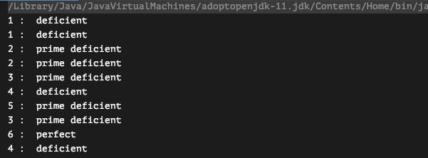

# lamdba ?

자바에서 함수형 프로그래밍을 위해 도입한 방법으로, 식별자 없이 실행가능한 함수를 뜻합니다. 문밥을 간결하게 할 수 있고, 가독성 또한 높일 수 있으므로
사용할 수 있다면 판단하여 사용하는것도 좋다고 생각됩니다. 멀티 스레드에서 병렬작업도 지원하므로, 사용할 수 있다면 사용하는것이 좋아보입니다!

## 함수형 프로그래밍이란 ?

- 말 그대로 함수를 이용한 프로그래밍으로, 함수를 인자값으로 사용하거나 리턴값으로 사용할 수 있으며, 순수 함수를 만들어 모듈화 수준을 높이는 프로그래밍

## 특징

- 함수가 1등 시민이 된다.
- 함수를 타입으로 지정할 수 있다.
- 함수를 인자값으로 넘길 수 있다.
- 함수를 리턴값으로 받을 수 있다.

## 순수함수란 ?

- 입력값이 동일하면 결과가 동일하게 리턴되는 함수.
- 쉽게 설명하면 add 라는 함수는 10, 5 라는 두 개의 정수가 인자값으로 오면, 무조건 15를 리턴한다.
- 순수함수가 아닌 함수와 순수함수인 함수의 예시는 아래와 같다.
- 두번째 함수는 순수함수가 아니다. 왜냐하면 밖에서 C의 값을 바꿔주면, C는 다른 값을 리턴한다.

```java
# Ex01
function add(a,b)
	return a+b;

# Ex 02
function add(a,b)
	return a+b+this.c
```

# 주요 관심사항

## Side-Effect(부작용)

- Side-Effect 가 일어나게 해서는 안됨. 즉 인자로 단순히 Object 를 넘겨주는 것이 아닌 Function 내 에서 새로운 Object 를 생성하여 전달해 주어야 함.

```java
static Function<Integer, Set<Integer>> factors = (number) -> {
      HashSet<Integer> factors = new HashSet<>(); // 기존 HashSet 을 받는것 보다, 다른걸 사용
        IntStream range = IntStream.rangeClosed(1, (int) Math.sqrt(number));
        range.forEach(ele -> {if(isFactor.apply(number, ele)){factors.add(ele); factors.add(number / ele);}});
      return factors;
    };

// 만약에 받아와야 되는 상황이라면 ?

static BiFunction<Integer, Set<Integer>, Set<Integer>> factors = (number, originalSet) -> {
      HashSet<Integer> factors = Set.copyOf(originalSet); // 기존 HashSet 을 받아서 복사하여 사용
        IntStream range = IntStream.rangeClosed(1, (int) Math.sqrt(number));
        range.forEach(ele -> {if(isFactor.apply(number, ele)){factors.add(ele); factors.add(number / ele);}});
      return factors;
    };
```

## 함수를 인자로 전달

```java
static public boolean isDeficient(Function<Integer, Set<Integer>> factors, int number) {
        return sum(factors.apply(number)) - number < number;
		}
```

## 멀티쓰레드에서도 안전한가?



- 그림에서 보듯 Thread 1 의 4 와 , Thread 2 의 4 는 deficient 라는 Type 이라고 정확하게 됨. 객체를 생성하여 사용하므로, 서로 다른 영향을 끼칠 수 없음.

## 불변성

**심볼의 값이 변경되지 않는가?** 일단 받아온 객체들은 전부 가변적으로 복사되기 때문에 외부 참조로 인해서 값이 변경될 수 없음. 외부에서 로직도중에 original Set 을 바꾸더라도 의미가 없음. 해당 로직진행은 originalSet 을 복사한 copySet 인 factors 로 진행이 되므로(**다른 객체이므로 JVM에서 다른 힙영역을 가지기 때문에**)

```java
static BiFunction<Integer, Set<Integer>, Set<Integer>> factors = (number, originalSet) -> {
      HashSet<Integer> factors = Set.copyOf(originalSet); // 기존 HashSet 을 받아서 복사하여 사용
        IntStream range = IntStream.rangeClosed(1, (int) Math.sqrt(number));
        range.forEach(ele -> {if(isFactor.apply(number, ele)){factors.add(ele); factors.add(number / ele);}});
      return factors;
    };
```

### 추신

- K 가 내가 잘못생각했던것을 짚어줘서 함수형 프로그래밍에 대해서 다시 생각하고, 다른 방식으로 코드를 다시 작성해 볼 수 있었다. 두가지 방식으로 작성해서 차이를 보니, BiFunction 이나 Function 은 Interface 를 값이 아닌 함수를 넘겨 받는 형식의 방식으로 설계할때 쓰면 좋을 듯한 느낌이 들었다.
- August 가 올려준 유튜브 링크는 재밌고, 쉽게 설명해주는것 같아 좋았다 ㅋㅋㅋㅋ