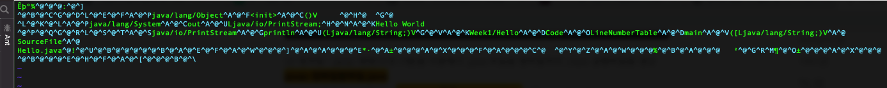
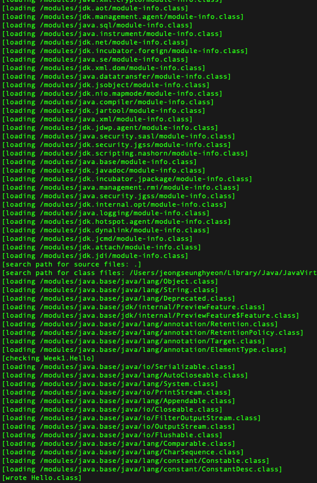

우리가 코드를 작성하게 될때의 흐름으로 정리했다.

그럼 Java 기준으로 코드의 실행순서를 정리해보자!! (JVM 에 대한 선행지식 약간은 필요)

- 우리가 저장한 코드가 저장되는 곳 ? ⇒ **보조기억장치**
- 우리가 저장한 코드가 실행되는 곳 ? ⇒ **주 기억장치**
- 우리가 설계한 로직들이 연산되는 곳 ? ⇒ **CPU(연산장치)**
- 우리가 설계한 로직들의 결과가 저장되는 곳 ? ⇒ **주 기억장치**

보조기억장치에서 주기억장치로 로드되기 위해서는 일련의 컴퓨터가 읽을 수 있는 정보가 필요하다. 

컴퓨터는 우리 자바 언어를 인식하지 못하기 때문에, **어셈블리어** 혹은 **자바 바이트 코드** 등으로 변환 한뒤,

런타임상에서 기계어로 바꾸어주어 인식하게 해야 한다.

Java 에서는 아래와 같은 번역과정을 거친다.

Hello.java ⇒ Hello.class (Java Byte Code) ⇒ Runtime (기계어)

그럼 우리는 이런 역할을 해주는 통역가가 필요하다. 그게 바로 **컴파일러**다.

자바에서는 1차적으로 Java Byte Code 로 바꿔주는데 **javac** 를 이용한다.

그럼 우리가 Hello.java 파일을 만들었다고 가정해보자

```java
public class Hello {
	public void static main(String[] args){
			System.out.println("Hello Java");
	}
}
```

이걸 돌리기 위해서는 위의 과정을 전부 순회하여야 한다. 그럼 진행해보자

```java
javac Hello.java
```

해당 명령어를 생성하고나면 아래와 같이 자신의 디렉토리에 Hello.class 라는 파일이 생긴다.

이 파일이 바로 **자바 바이트 코드**라는 파일이다. (기계어 전단계 C로 치면 어셈블리어라고 생각하면 된다.)

해당 파일을 열어보면 알수없는 문자들로 가득하다.



근데 자세히 보면 **java/lang/String** 같은 것이 적혀있는걸 볼 수 있다.

아까 설명했듯이, 런타임 상에서 **Link 즉, 연결시켜주는 로직이 존재하는데 해당 로직은 바이트 코드를 참조해 해당 클래스로 연결시켜준다.** 

그니까 우리가 작성한 Code 는 우리의 언어이고, 그걸 javac 가 바이트 코드라는 하나의 언어로 재 탄생시키고, 

JVM 에서  **Excutor Engine** 이 **JIT - Compiler** 러와 **Interpreter** 방식을 이용하여 자바 바이트 코드를 읽어서 기계어로 적절히 변환시키고, **Class Loader** 라는 녀석들이 바이트 코드에 적혀있는 링크 정보들을 종합하여, 런타임상에서 링킹해준다. 그래서 우리가 외부 라이브러리 혹은, 내부에 선언한 클래스들을 이용할 수 있는 것이다.

눈으로 봐야 더 빠르기 때문에 아까 해당 바이트 코드의 링크 정보를 살펴보자!

```java
javac -verbose Hello.java
```



막 복잡하게 여러 클래스들이 보이는데 저기 맨 밑쪽 단의 System.Class 만 봐도, 우리가 System.out.println 을 동작시키기 위해, 해당 클래스의 위치에서 해당 클래스를 **Loading 해옴**을 알 수 있다.

이제 위에서 말했던 Linking 이 조금 이해가 갈거라고 믿는다!!

**Linking** 은 이런 Class path 를 바탕으로 해당 Class 의 정보들을 연결 할 수 있도록 해주는 것이다. 

이제 간략하게 정리해보면

 [Hello.java](http://hello.java)    javac    Hello.class    Excution Engine        기계어        Class Loader                    JRD

보조기억장치    ⇒       보조기억장치              ⇒                   주 기억장치             ⇒           클래스 작업   ⇒  실행

- JRD = Java Runtime DataArea : 프로그램을 수행하기 위해 OS 에서 할당받은 메모리 공간.

## 추신

- 어려울까봐 매우 간략하게 나타내었다. 그래서 조금 더 자세하게 알려면 JVM 에 대한 공부만 해도 연관지어서 생각하기 쉬울꺼라고 생각!

# 추가 내용

- 우리가 코드를 왜 보조기억장치에 저장하는가 ?
    - 코드는 프로젝트 당 몇만줄 몇천만줄이 존재하는데, 이를 주기억장치에 저장하는 것은 말이 안됨.
    - 주기억장치는 속도가 빠른대신 저장용량이 적고 비쌈. 그래서 주기억장치에 저장할 수 없고, 보조기억장치에 저장된 파일을 주기억장치로 Load 해오는 방식을 이용함.
- 요즘 주기억 장치는 용량도 큰데 왜 그럼 저장을 안할까?
    - 주 기억장치는  휘발성 메모리 이므로, 저장하면 큰일난다.
    - 우리가 자바코드를 돌릴때 실행할 때 마다 변수 값을 바꿀 수 있는 이유도, 아까 말했듯이 위에 JDR 에 대한 정보도 JVM 이 내려갈때 메모리상에서 데이터가 삭제되기 때문에다. 즉, 메모리에서 동작이 멈추면 그냥 데이터는 휘발(삭제) 된다. ⇒ 그래서 JVM 에서 한 Method Stack 이 가지는 메모리 영역에서 Method 가 종료되면, 데이터가 삭제되는 것이다. 그래서 필드변수 스코프 같은 경우도 존재하는 것이다.
- CPU 에서 연산을 진행하는 이유는 ?
    - CPU 는 연산속도가 진짜 빠르나 용량이 적다. 그래서 연산 하나 하나에 대한 처리만 도맡고, 결과값은 메모리에 저장하게 된다. 메모리와 CPU 사이에 속도 차이도 있어서 이 속도차이를 상쇄하기 위해 중간에   Cache 가 존재한다. 우리가 Cache Memory 하는 것들이  다 이녀석이다.
- 주메모리에 있는 명령을 CPU 로 로드하는 것 : IF(Inspection Fetch)