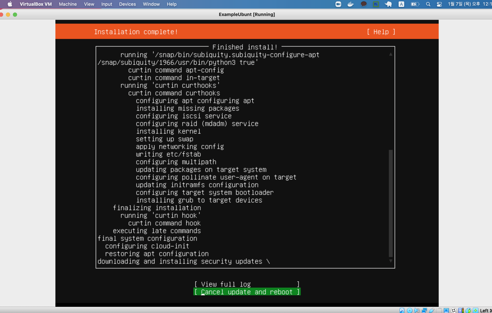
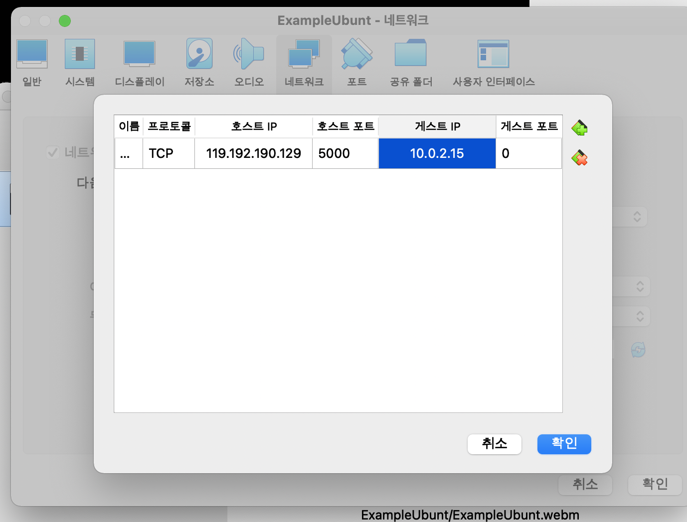
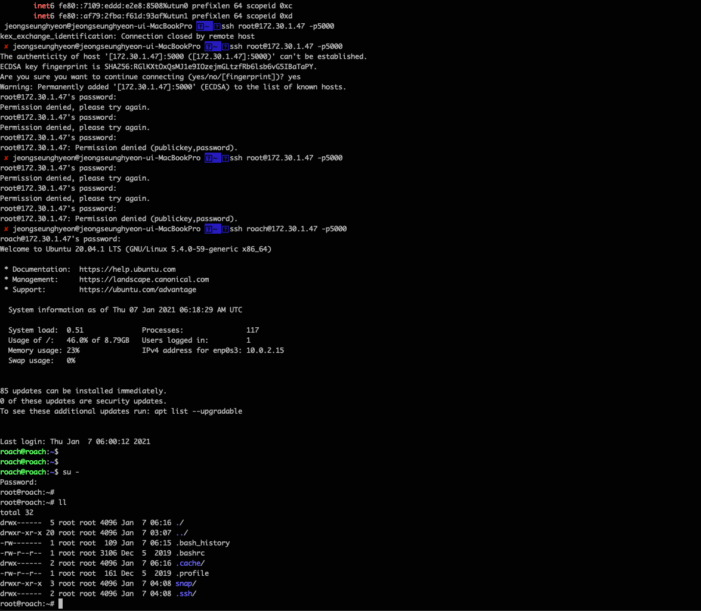
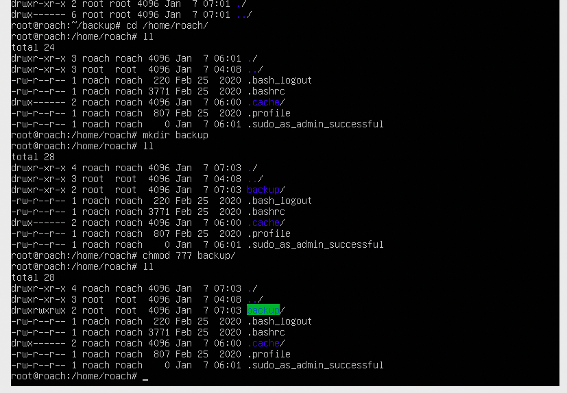
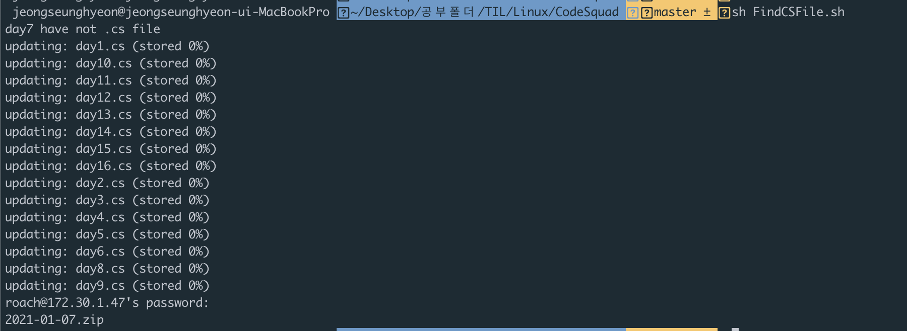
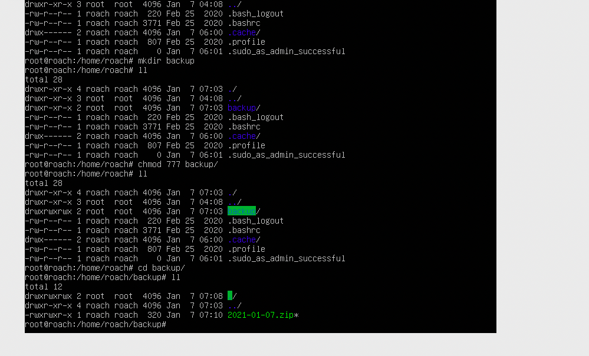
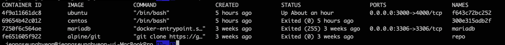

# Virtual Box 를 통한 리눅스 설치

처음에 Virtual Box 를 통해 Linux 를 까는데 어려움은 없었다. <br>
이전에도 많이 깔아봤던 터라 별 다른 어려움은 없었고, 30분안에 깔았던것 같다. <br>
그래도 조금은 도움되는 것들이 있어 글을 남기려고 한다 <br>

아래는 다운로드시 화면이다.. 진짜 투박하다 <br>



## port forwarding

포트 포워딩은 한마디로 나에게 이포트로 오면 내가 다른포트로 넘겨줄께? 약간 이런개념이라고 이해하고 있는데. <br>
사전 적인 개념으로는 포트 포워딩은 컴퓨터 네트워크에서 패킷이 라우터나 방화벽같은 네트워크 게이트웨이를 가로지르는 동안 하나의 IP 주소와, 포트 번호 결합의
통신 요청을 다른 곳으로 넘겨주는 네트워크 주소변환의 일종이다. 라고 적혀있다. 말 그대로 인것 같다. 어렵게 느껴져서 그렇지 딱 해보면 감이온다. <br>
VirtualBox 에는 고급기능에 포트포워딩이 있더라 Wls 같은 경우는 수동으로 해줘야되서 귀찮았는데, 역시 GUI 가 편하다. <br>



# SSH Service Start

```shell_script
    systemctl status ssh
    # if ssh off
    systemctl start ssh | systemctl restart ssh
```

여튼 어떤 방식으로던 ssh 를 켜고, 자기가 지정해둔 포트로 원격접속하면 된다. 원격접속되면 아래와 같다. <br>



# FindCSFile 요구사항

1. 내 PC의 특정한 디렉토리 아래 day1 ~ day16 까지 문제 해결을 저장한 디렉토리가 있다고 가정
   - 각 폴더내에는 작업한 소스 파일들이 들어있다.
   - 작업한 소스는 a.cs 처럼 파일 내용은 없어도 되고, 확장자가 cs 로 끝난다.
2. Shell 을 통하여 현재 디렉토리 아래있는 day1 에서 day16 디렉토리 중에서 .cs 파일만 zip으로 압축해서 백업하는 스크립트를 자동화해서 구현한다.
3. 스크립트 진행 도중에 .cs 파일이 없는 디렉토리가 있으면, 어느 디렉토리가 없는지 문구를 출력한다.
4. 스크립트 파일은 /backup 폴더에 저장되며 .zip파일로 압축되어 있다.
   - 압축 파일명은 오늘날짜가 붙어있다.

# Shell Script

```shell
#bin/bash

# Requirements
# Specific Directory : CodeSquad
# Child Directory : day1 ~ day16
# Find File : .cs extend File
# If find .cs extend files, compress to .zip file

# Definition Field

SPECIFIC_DIRECTORY=/Users/jeongseunghyeon/Desktop/공부폴더/TIL/Linux/CodeSquad
CHILD_DIRECTORY=`ls -all | grep day | awk '{print $9}'`
TODAY=`date +%Y-%m-%d`
BACKUP_FOLDER_NAME=backup

# Definition Function

inspectionExistFile() {
        local CS_FILE=`ls -all | grep .cs | awk '{print $9}'`
        if [ -z ${CS_FILE} ] ; then
                echo "${folder} have not .cs file"
        fi
}

# Make backup Folder
mkdir -p ${BACKUP_FOLDER_NAME}/${TODAY}

#Save child Directory to Array
for folder in ${CHILD_DIRECTORY}
do
        cd /${SPECIFIC_DIRECTORY}/${folder}/
        EXTEND_CS_FILE=`ls -all | grep .cs | awk '{print $9}'`

        # If Exist .CS File?
        inspectionExistFile # func

        for csfile in ${EXTEND_CS_FILE}
        do
                if [ -e ${csfile} ] ; then
                        cp -r ${csfile} ../${BACKUP_FOLDER_NAME}/${TODAY}
                fi
        done
done

#Move Directory to Backup Folder
cd ..
cd backup/${TODAY}

#Compress File
zip $TODAY.zip ./*

#synchronized chmod ssh server folder
chmod 777 $TODAY.zip

# send
scp -P 5000 $TODAY.zip roach@private_ip:~/backup/
```

## 권한 설정

- scp 로 설정하기 위해서는 원격(Remote) 의 폴더에도 권한설정이 이루어져야함. 그래서 chmod 777 을 주고 진행하였음



## 전송



## 수신완료



# 후기

- Shell 짜는데 20분 가량 걸린것 같다. 너무 오랜만에 해서 기억이 안나는 탓인지 그래도 최대한 깔끔하게 적어보려고 노력했다.
- 아직도 셸은 이정도 밖에 못사용하는것 같다. 운영체제 공부할때 리눅스환경에서 공부해야지!

# 추신

- 아 참고로 Virtual Box 는 실습용이며 오늘 삭제될 예정이다.
- 난 도커를 더 좋아한다


