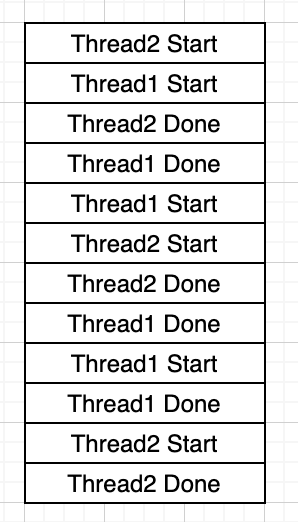

# Thread 예시

- 아주 간단하게 일단은, 돈의 입 / 출금 형태로 코드를 구성하였다. 
- 아래코드는 은행 계좌의 간소한 역할인 입 / 출금만 진행하는 코드로 Thread 간 다른 Obj 를 주고 어떤 Thread 가 먼져 실행되는지 테스트 해볼 것이다.

## 테스트 과정

- Child Thread 를 구성한다. 
- 보유 잔액 : 10000
- 이름 : jsh
- 입금액 : 10000 원 씩 * 총 10회
- Sleep : 3 seconds

- Parent Thread 를 구성한다.
- 보유잔액 : 110000
- 이름 : yjs
- 입금액 : 10000 원 씩 * 총 10회
- sleep : 3 seconds

## 예상 결과

- Thread 의 실행 순서는 알 수 없다. 왜냐하면 OS 가 Thread 의 실행 순서를 제어하는데, 그 순서는 보장해 주지 못한다. <br>
- A -> B 로 갈지 B->A 로 갈지 알수 없다. 비 동기적인 여러 갈래의 흐름으로 흐르기 때문이다.

```java
package Example02;

public class Account {

    private int account; // 계좌

    private String username;

    public Account(int account, String username){
        this.account = account;
        this.username = username;
    }

    public void deposit(int money){
        String msg = String.format("%s 님이 %d 만큼 입금하셨습니다.", username, money);
        System.out.println(msg);
        account += money;
        System.out.println("남은 계좌는 : " + account);
    }

    public void withDraw(int money){
        if(account - money > 0){
            String msg = String.format("%s 님이 %d 만큼 출금하셨습니다.", username, money);
            System.out.println(msg);
            this.account -= money;
            System.out.println("남은 계좌는 : " + account);
        }else{
            System.out.println("잔액이 부족합니다.");
        }
    }
}

```

### Child Thread 구성코드
```java
package Example02;

public class ChildThread implements Runnable{

    private String name;
    private int account;
    private Account accountObj;

    public ChildThread(String name, int account){
        this.name = name;
        this.account = account;
        accountObj = new Account(account, name);
    }

    @Override
    public void run() {
        try {
            for(int i = 0; i<10; i++){
                accountObj.deposit(10000);
                Thread.sleep(3000);
            }
        }catch (Exception e){
            e.printStackTrace();
        }
    }
}

```

### Parent 구성코드
```java
package Example02;

public class ParentThread implements Runnable{

    private String name;
    private int account;
    private Account accountObj;

    public ParentThread(String name, int account){
        this.name = name;
        this.account = account;
        accountObj = new Account(account, name);
    }

    @Override
    public void run() {
        try {
            for(int i = 0; i<10; i++){
                accountObj.deposit(10000);
                Thread.sleep(3000);
            }
        }catch (Exception e){
            e.printStackTrace();
        }
    }
}
```

### 메인에서 테스트

```java
package Example02;

public class Main {

    public static void main(String[] args) {
        ChildThread childThread = new ChildThread("jsh", 10000);
        ParentThread parentThread = new ParentThread("yjs", 110000);
        Thread thread1 = new Thread(childThread);
        Thread thread2 = new Thread(parentThread);

        thread1.start();
        thread2.start();
    }
}

```

## 테스트 결과


## 테스트 결과로 알게된점

- 처음하고 둘째 줄을 봤을때, 입금 후 남은 계좌가 바로 연달아서 나와야 하나 남은 계좌가 나오기 전 다른 Thread 가 실행되는것을 볼 수 있다.<br>
이를 작업도로 그려보면 아래와 같다. 아래와 같이 Thread 는 정확한 순서를 보장하지 못한다. 그렇다면 우리가 Thread 의 실행 순서를 보장해주기 위해서는 어떻게 해야 할까?
그래서 등장한것이 Thread.join() 이다.




## Thread Join

- Thread Join 은 Thread 의 실행 순서를 정해 줄 수 있다. 우리가 한가지 알아야 될 사실은 Main 도 하나의 Thread 라는 것이다.
처음에는 Main 도 하나의 Thread 라면 