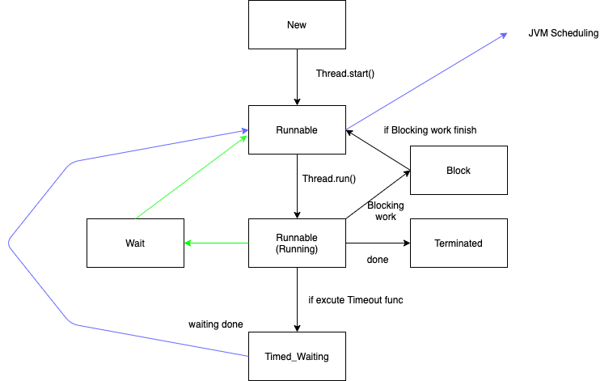
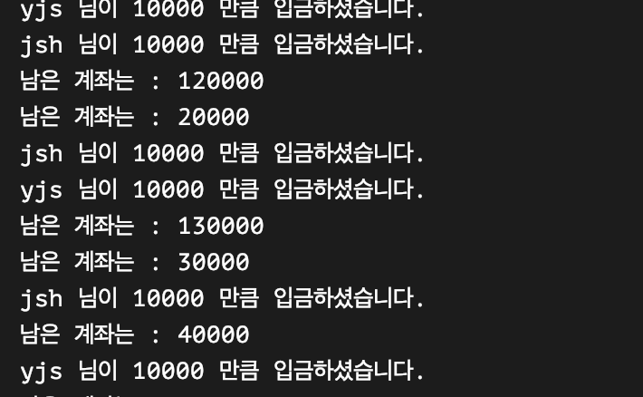
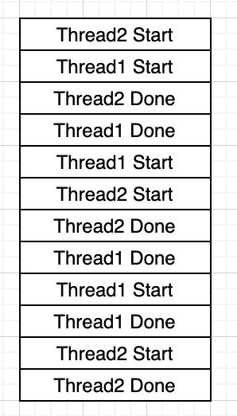

# Thread 란 ?

Thread 란 프로세스 내에서 진행되는 일련의 작은 작업의 흐름이라고 보면 된다. OS 단에서 프로세스에게 자원을 할당해주면, Thread 들은 그 자원을 나누어 받아
작업을 진행한다. 예시로 우리가 이용하는 Main 문도 하나의 Thread 이다. 

## Thread 의 특징

- 스레드는 프로세스 내에서 각각 Stack 만 따로 할당받고, Code, Data, Heap 의 영역은 공유된다. => 이로 인해 객체 동시 참조로 인한 오류가 발생할 수 있다.
- **한 스레드가 프로세스 자원을 변경하면, 다른 이웃 스레드도 그 변경 결과를 즉시 볼 수 있다.**

## Java Thread 란?

- 일반 Thread 와 별차이가 없으며, JVM 이 운영체제의 역할을 한다.  => 즉 JVM 이 OS 라 한다면, Thread 는 Process 의 위치이다. 
- 자바에서 **스레드 스케쥴링은 전적으로 JVM에 의해 이루어진다.** => 스케쥴링이 있다는건 Priority 의 선정방식이 있다는 것이다.


## Thread Life Cycle

Thread 의 생명주기는 아래 도식과 같다.



- **NEW** : Thread 객체가 생성된 상태지만, 아직 start() 란 함수를 작동하지 않은 상태이다. 즉 아직은 JVM 이 쓰레드 스케쥴링을 하지 않는다.

- **RUNNABLE** : start() 가 발생하면 일단 호출 대기 상태가 되며, 이후 run() 함수가 작동하면, Running 하며 CPU를 점유한다. Runnable Pool 에 모여있다.

- **WAITING** : 다른 쓰레드에서 notify 등으로 자신이 작업한다는 것을 알릴때, 해당 Thread 를 기다리는 동안 갖게 되는 상태이다.

- **TIMED_WAITING** : 일시 정지, Timeout 등으로 걸린 시간이 지 때까지 대기 하는 상태이다.

- **BLOCK** : BLOCKING WORK 흔히 말하는 NetWork 통신을 통한 데이터 전송 혹은 DB 작업 등 Blocking 을 줄 수 있는 작업을 진행할 시 받게 되는 작업상태이다. <br>
  해당 작업이 끝나고 lock 이 풀려야 다시 Runnable 로 돌아가게 된다.

- **TERMINATED** : 실행 마치고 종료된 상태, run() 단계의 working 이 끝난 상태이다.

우리는 Thread 의 생명주기에 대해서는 여기서는 간단히 개념만 알고 밑에 코드 와 동작과정에 대해 설명하게 되면서, 더 자세하게 알 수 있을 것이다. <br>
일단은 개념만 잡자! 개념만!!

# Thread 예시

- 아주 간단하게 일단은, 돈의 입 / 출금 형태로 코드를 구성하였다.
- 아래코드는 은행 계좌의 간소한 역할인 입 / 출금만 진행하는 코드로 Thread 간 다른 Obj 를 주고 어떤 Thread 가 먼져 실행되는지 테스트 해볼 것이다.

## 테스트 과정

- Child Thread 를 구성한다.
- 보유 잔액 : 10000
- 이름 : jsh
- 입금액 : 10000 원 씩 \* 총 10회
- Sleep : 3 seconds

- Parent Thread 를 구성한다.
- 보유잔액 : 110000
- 이름 : yjs
- 입금액 : 10000 원 씩 \* 총 10회
- sleep : 3 seconds

## 예상 결과

- Thread 의 실행 순서는 알 수 없다. 왜냐하면 OS 가 Thread 의 실행 순서를 제어하는데, 그 순서는 보장해 주지 못한다. <br>
- A -> B 로 갈지 B->A 로 갈지 알수 없다. 비 동기적인 여러 갈래의 흐름으로 흐르기 때문이다.

```java
package Example02;

public class Account {

    private int account; // 계좌

    private String username;

    public Account(int account, String username){
        this.account = account;
        this.username = username;
    }

    public void deposit(int money){
        String msg = String.format("%s 님이 %d 만큼 입금하셨습니다.", username, money);
        System.out.println(msg);
        account += money;
        System.out.println("남은 계좌는 : " + account);
    }

    public void withDraw(int money){
        if(account - money > 0){
            String msg = String.format("%s 님이 %d 만큼 출금하셨습니다.", username, money);
            System.out.println(msg);
            this.account -= money;
            System.out.println("남은 계좌는 : " + account);
        }else{
            System.out.println("잔액이 부족합니다.");
        }
    }
}

```

### Child Thread 구성코드

```java
package Example02;

public class ChildThread implements Runnable{

    private String name;
    private int account;
    private Account accountObj;

    public ChildThread(String name, int account){
        this.name = name;
        this.account = account;
        accountObj = new Account(account, name);
    }

    @Override
    public void run() {
        try {
            for(int i = 0; i<10; i++){
                accountObj.deposit(10000);
                Thread.sleep(3000);
            }
        }catch (Exception e){
            e.printStackTrace();
        }
    }
}

```

### Parent 구성코드

```java
package Example02;

public class ParentThread implements Runnable{

    private String name;
    private int account;
    private Account accountObj;

    public ParentThread(String name, int account){
        this.name = name;
        this.account = account;
        accountObj = new Account(account, name);
    }

    @Override
    public void run() {
        try {
            for(int i = 0; i<10; i++){
                accountObj.deposit(10000);
                Thread.sleep(3000);
            }
        }catch (Exception e){
            e.printStackTrace();
        }
    }
}
```

### 메인에서 테스트

```java
package Example02;

public class Main {

    public static void main(String[] args) {
        ChildThread childThread = new ChildThread("jsh", 10000);
        ParentThread parentThread = new ParentThread("yjs", 110000);
        Thread thread1 = new Thread(childThread);
        Thread thread2 = new Thread(parentThread);

        thread1.start();
        thread2.start();
    }
}

```

## 테스트 결과



## 테스트 결과로 알게된점

- 처음하고 둘째 줄을 봤을때, 입금 후 남은 계좌가 바로 연달아서 나와야 하나 남은 계좌가 나오기 전 다른 Thread 가 실행되는것을 볼 수 있다.<br>
  이를 작업도로 그려보면 아래와 같다. 아래와 같이 Thread 는 정확한 순서를 보장하지 못한다. 그렇다면 우리가 Thread 의 실행 순서를 보장해주기 위해서는 어떻게 해야 할까?
  그래서 등장한것이 Thread.join() 이다.



## Thread 상태 파악

- Thread 의 상태 파악을 하기 위해서 I/O 작업을 일으켜야 할것 같았다. 그래서 md 파일을 읽어오는 방식을 이용했다.. ㅎㅎ..
- 그래서 간단하게 FileReaderUtil.java 파일을 만들었다. 구성은 아래와 같다.

```java
package Thread;

import java.io.BufferedReader;
import java.io.FileReader;

public class FileReaderUtil {

    public int readFile(String filePath) {
        BufferedReader br = null;
        StringBuffer sb = new StringBuffer();
        try {
            br = new BufferedReader(new FileReader(filePath));
            String line = null;

            while ((line = br.readLine()) != null) {
                sb.append(line);
            }
        } catch (Exception e) {
            e.printStackTrace();
        } finally {
            try {
                if (br != null) {
                    br.close();
                }
            } catch (Exception e) {
                e.printStackTrace();
            }
        }
        return sb.length();
    }
}
```

간단히 Md file 이 몇 줄인지 알아볼 수 있는 함수라고 생각하면 된다.

- 그냥 간단히 파일을 읽기 위해서 작업을 하고, 두 Thread 에 간단하게 I/O 작업을 일으킬만하게 부하를 줘보자!

```java
for (int j = 0; j < 100000; j++) {
    fileReaderUtil.readFile(testMD);
}
```

- 근데 아직 Block 은 구현하지 못했다. Block 은 좀.. DB 단에 데이터를 엄청 넣어놓고 가져오는? 그런 작업이 진행되어야 할듯하다. <br>
  일단 위의 코드 부터 간단히 설명하자면 readfile 을 100000번한다 한마디로 그냥 부하 그자체이다.

- 이걸 실행시킨다면 이제 실행주기가 아래와 같이 보인다.

```
12 : jsh Thread
13 : yjs Thread

12.getState() = NEW => 생성된 상태
13.getState() = NEW => 생성된 상태
jsh 님이 10000 만큼 입금하셨습니다.
yjs 님이 10000 만큼 입금하셨습니다.
남은 계좌는 : 20000
남은 계좌는 : 120000
12.getState() = RUNNABLE
13.getState() = RUNNABLE
12.getState() = RUNNABLE
13.getState() = RUNNABLE
12.getState() = RUNNABLE
13.getState() = RUNNABLE
12.getState() = RUNNABLE
13.getState() = RUNNABLE => 작업 진행중
12.getState() = RUNNABLE => 작업 진행중

12.getState() = TIMED_WAITING => Sleep 함수로 인한 Timeout
13.getState() = TIMED_WAITING
12.getState() = TIMED_WAITING
13.getState() = TIMED_WAITING
12.getState() = TIMED_WAITING

12.getState() = TERMINATED

```

위와 같은 코드로는 우리가 WAIT 과 BLOCK 은 보지 못했다. 왜일까?

우리가 멀티 스레딩 환경으로 돌렸기 때문에, 그냥 두 스레드가 돌아갈 것이다. 우리가 Block 은 JPA 를 사용해서 DB 를 읽는 걸 본다하면, <br>
WAIT 은 스레드간의 순서를 정해준다고 생각하면 편하다. 단순히 숫자의 순서가 아닌, **나 다음에 너가 해** 라는 식의 순서이다. <br>
백문이 불여일견이라고 구현해보자!!

- 일단 아래와 같이 코드를 구현해보자

```java
        thread1.start();
        synchronized (thread1) {
            try {
                System.out.println("jsh 의 Thread 작업을 기다립니다.");
                thread1.wait();
            } catch (Exception e) {
                e.printStackTrace();
            }
        }
        thread2.start();
```

이렇게 되면 결과는 아래와 같다.

```
12.getState() = NEW
13.getState() = NEW
12.getState() = RUNNABLE
13.getState() = NEW
12.getState() = RUNNABLE
13.getState() = NEW
12.getState() = RUNNABLE
```

근데 우리가 보고싶은건 WAIT 이다!! 그렇다면 코드를 수정해보자!

## Synchronized 예시 보기

```java
package Thread;

public class SyncronizedExample {
    private String mMessage;

    public static void main(String[] agrs) {
        SyncronizedExample temp = new SyncronizedExample();
        System.out.println("Test start!");
        new Thread(() -> { for (int i = 0; i < 1000; i++) { temp.callMe("Thread1"); } }).start();
        new Thread(() -> { for (int i = 0; i < 1000; i++) { temp.callMe("Thread2"); } }).start();
        System.out.println("Test end!");
    }
    public void callMe(String whoCallMe) {
        mMessage = whoCallMe;
        try {
            long sleep = (long) (Math.random() * 100);
            Thread.sleep(sleep);
        } catch (InterruptedException e) {
            e.printStackTrace();
        } if (!mMessage.equals(whoCallMe)) {  // Synchronized 로 하지않으면 값이 다를때도있음
            System.out.println(whoCallMe + " | " + mMessage);
        }
    }
}

```

### 결과값

```
Thread1 | Thread2
Thread2 | Thread1
Thread1 | Thread2
Thread2 | Thread1
Thread1 | Thread2
Thread2 | Thread1
Thread1 | Thread2
Thread2 | Thread1
Thread1 | Thread2
```

### Synchronized 를 함수에 정의해보자

```java
    public synchronized void callMe(String whoCallMe) {
        mMessage = whoCallMe;
        try {
            long sleep = (long) (Math.random() * 100);
            Thread.sleep(sleep);
        } catch (InterruptedException e) {
            e.printStackTrace();
        } if (!mMessage.equals(whoCallMe)) {  // Synchronized 로 하지않으면 값이 다를때도있음
            System.out.println(whoCallMe + " | " + mMessage);
        }
    }
```

## Thread Join

- Thread Join 은 Thread 의 실행 순서를 정해 줄 수 있다. 우리가 한가지 알아야 될 사실은 Main 도 하나의 Thread 라는 것이다.
  처음에는 Main 도 하나의 Thread 라면 순서를 지정해줄 수 있다. 일단은 우리는 두 Thread YJS 와 JSH 간의 관계를 Join 으로 표시해보자.

```java
        try{
            thread1.start();
            thread1.join();
            thread2.start();
        }catch (Exception e){
            e.printStackTrace();
        }
```

### 터미널 결과
```
14.getState() = NEW
13.getState() = RUNNABLE
14.getState() = NEW
13.getState() = RUNNABLE
14.getState() = NEW
13.getState() = RUNNABLE
14.getState() = NEW
13.getState() = RUNNABLE
14.getState() = NEW
```

### 의문점

- 이렇게 보면 Synchronized 랑 join 이랑 별 차이가 없어 보인다. 근데 우리는 차이를 발견해야 한다. <br>
사실 일반적인 상황에서는 찾기 힘든 예시인데.. 일단 둘의 차이점은 아래와 같다.

> Thread.join 은 단순히 하나의 작업이 끝날때 까지 다른 Thread 를 기다리게 하는 것이다. Synchronized 는 그런 개념이 아니라,
> 한 코드에 대해서 동시점에 해당 코드를 못보게 하도록 막아야 할때 쓰이는 것이다.

## 우선순위를 통한 수동 스케쥴링


#### 예시

**만약 C 객체가 원격 데이터베이스 서버의 Entity 객체라고 해보자.**<br>

- 우리가 DB 에 접근하는데, 만약 A 스레드에서 DB 에 천만건의 정보를 올리는 작업을 진행한다고 해보자. <br>
그럼 DB 에 Transaction 작업이 일어나는 것이므로, 해당 작업에 대해 무결성을 보장받아야 한다. <br>
근데 Thread B 에서 만약 A 작업중에 같은 객체로 DB 에 접근하려고 한다고 해보자. 그럼 무결성이 보장되지 않는다. <br>
따라서 Lock 기능이 필요한데, 이때 C 객체에 Synchronized 를 사용하면 된다. 다른 스레드의 침해로 일어날 수 있는 작업들에 대해서는 Synchronized 를 지정해 줘야 한다.
근데 만약 A 작업이 완료되고 B 작업이 진행되는 로직이라면 해당 로직에는 Join 을 써주면 된다.

**여담.. 알아보다보니 JPA 는 Lock Mode 라는 것을 지원한다고 한다.**

# 느낀점

- 다음 스터디 조사는 Thread Poll 을 하면 좋을 것 같다. 사실 Thread Pool 을 통해, 대규모 요청을 병렬처리 하거나 프로세스를 기획하고, 실무에 도입할 수 있을것
같은데, 궁금하기도 하다.