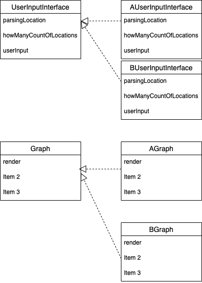
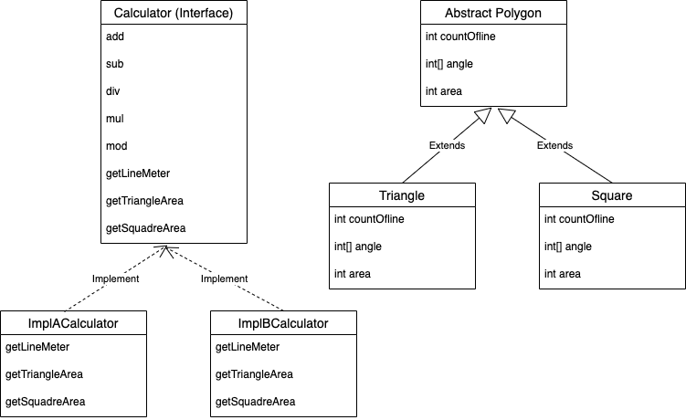

# Week2

Polygon (다각형) 은 다각형들의 공통적인 특성을 가진 추상클래스이다. <br>

이를 삼각형.. 사각형.. 등등이 상속받아, 공통적인 속성을 제거해준다. <br>

Calculator 는 계산기가 가져야할 요구사항을 명시해놓은 인터페이스 이다. <br>

---------------- Calculator -------------------- <br>

add(int a, int b) <br>

sub(int a, int b) <br>

div(int a, int b)<br>

multi(int a, int b)<br>

mod(int a, int b) <br>

getLineMeter(int x1, int y1, int x2, int y2) --- 두점 사이의 거리 공식<br>

getTriangleArea(int width, int height) ---- 두변사이로 구하기<br>

@Overload
getTriangleArea(int x1, int x2, int x3) ---- 헤론의 공식<br>

getSquadreArea(int width, int height) ---- return width * height<br>

계산기들이 이를 인터페이스로 받아들여 만든다.<br>

--------------------------------------------------

**다각형의 성질 하려고했으나 별로 필요한것 같지 않아 일단 정리만 해두었다!**

- 자유도
	n 각형의 자유도는 2n 이다. 그 중 2는 위치를, 1은 놓여있는 방향을 , 1은 전체적인 크기를 결정하며 나머지 2n-4가 모양을 결정한다.
	다각형에 선대칭성이 있을 경우 모양에 대한 자유도가 n-2로 줄어든다. 일반적으로 k를 2 이상의 정수라고 하면, k겹 

- 각
	정다각형이건 아니건, 단순하건 단순하지 않건, 다각형은 변의 수만큼의 각을 갖는다.

- 변의 개수

----------------- Polygon ----------------------

int countOfline;
int[] angle;
int area;

----------------- Main ------------------

DI
```java
Calculator cal = new implCalc;
Graph graph = new implGraph;
UserInputInterface = new impleUserInputInterface;
```


arg 2 -- getLineMeter

arg 3 -- getTriangleArea
			getLineMeter * 3 - needs

arg 4 -- getSquadreArea
			getLineMeter * 2 - needs

---------------------------------------

# 객체 설계도





Main 로직에서는 해당 부분들을 구현체로 받아들여 DI 패턴으로 설계하였다. 자세한 내용은 Pull Request 참조


