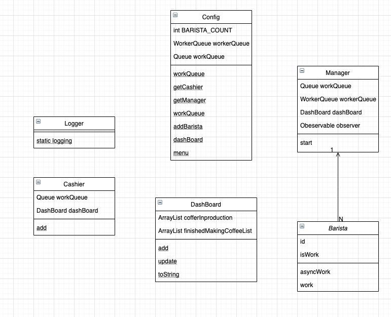

# 설계시 고려했던 사항
로직

1. 고객이 아이템을 선택 한다.
2. 고객이 해당 아이템을 주문(이벤트) 한다.
3. Cashier 는 고객의 주문을 받는다(이벤트 핸들링).
4. 캐쉬어는 주문을 주문 대기표에 넣는다.
5. 매니저는 1초마다 주문 대기표를 확인하여, 비어있는 바리스타가 있는지 확인한다.
6. 쉬고 있는 바리스타가 있으면 7로 넘어가고, 아니면 5를 반복한다.
7. 바리스타는 일감을 받는다. (다수의 바리스타 일수도 있다.)
8. 바리스타는 일감을 수행한다. (수행 시작 이벤트를 발생시킨다. => 해당 작업은 로그로 출력된다.)
9. 바리스타는 일감을 완료한다. (일감 완료 이벤트를 발생시킨다. => 마찬가지로 로그)
10. 매니저는 일감 완료 이벤트를 받으면 현황판을 업데이트 한다.

Order

- 커피 이름
- 가격
- 주문자
- 수량

Coffee

- 커피이름
- 제작시간
- 가격

Barista

- 작업중인 커피(일감)

Cashier

- 주문 받은 커피
- 주문 대기표

- 고객한테 받은 주문을 주문 대기표에 넣는다.

Manager

- 주문 대기표
- 대쉬 보드

DashBoard

- 제작중인 커피

Config

- 카페 사장과도 같은 존재로, 메뉴에 대한것과 바리스타는 몇명인지를 설정 및 주입해주는 역
할
  
App

- 기능을 동작하게 하는 Application

## 클래스 도식

## 이벤트 흐름

1. 손님이 주문하면 캐시어가 주문을 받는다.
2. 캐시어는 받은 주문을 workQueue 에 Order 를 추가하고, DashBoard 에 작업중인 물품이 있음을 추가해준다.
3. Manager 는 workQueue 를 탐색하다 Order 를 발견한다.
4. Manager 는 유휴 바리스타가 있는지 확인 한 후 있으면 일감을 나눠준다.
5. Manager 는 일감을 나눠준 바리스타의 work(비동기 작) 를 구독해둔 상태이다.업
6. Barista 는 받을 일감을 처리한 후 Coffee 이름과 작업을 완료했음을 알리는 이벤트를 전파해준다.
7. Manager 는 Barista 에게 이벤트를 받으면 작업이 완료된 커피는 DashBoard 의 작업완료된 커피에 추가해준다.
8. 해당 작업을 반복한다.